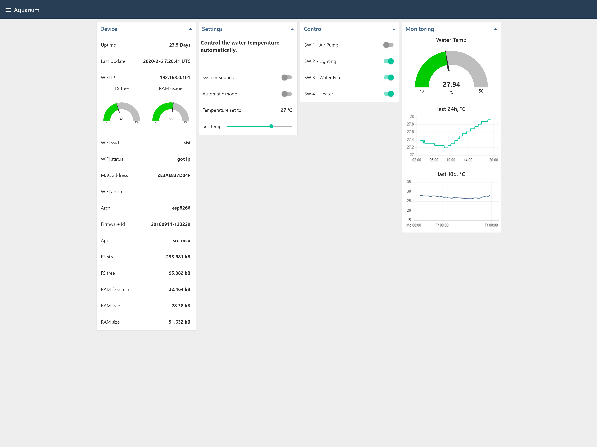
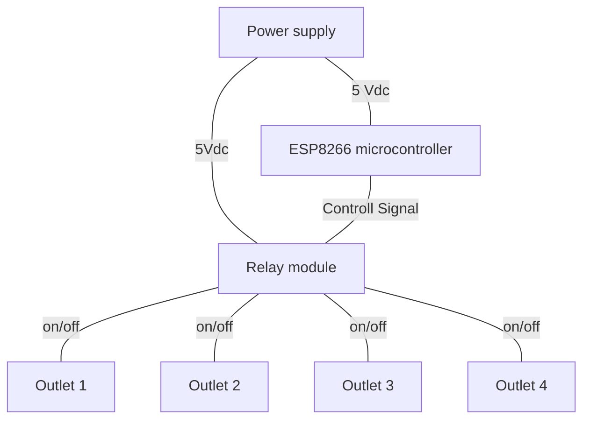
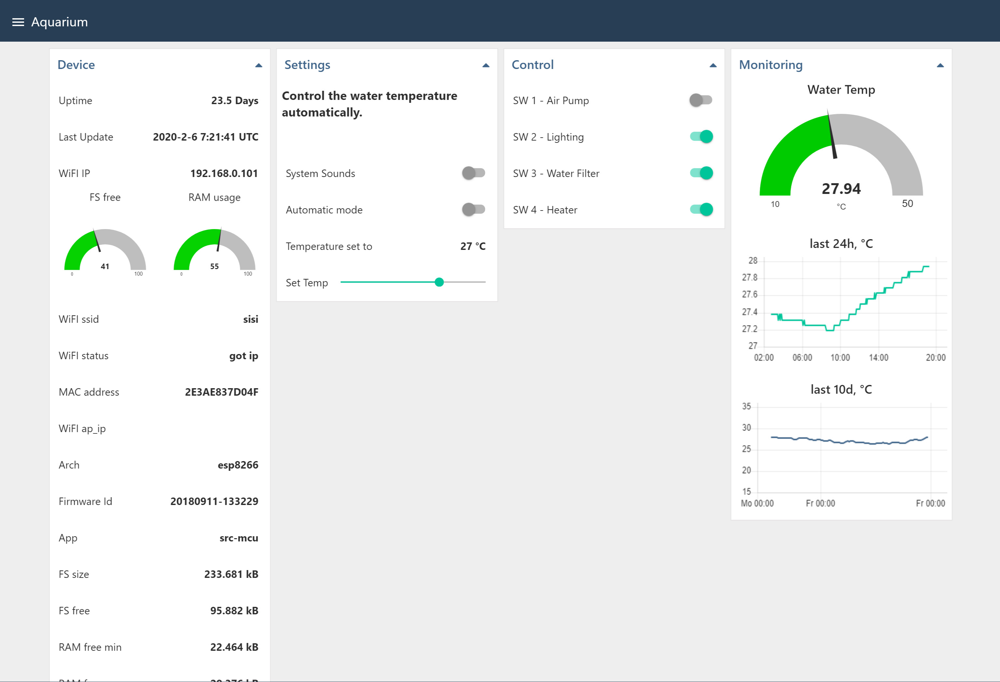
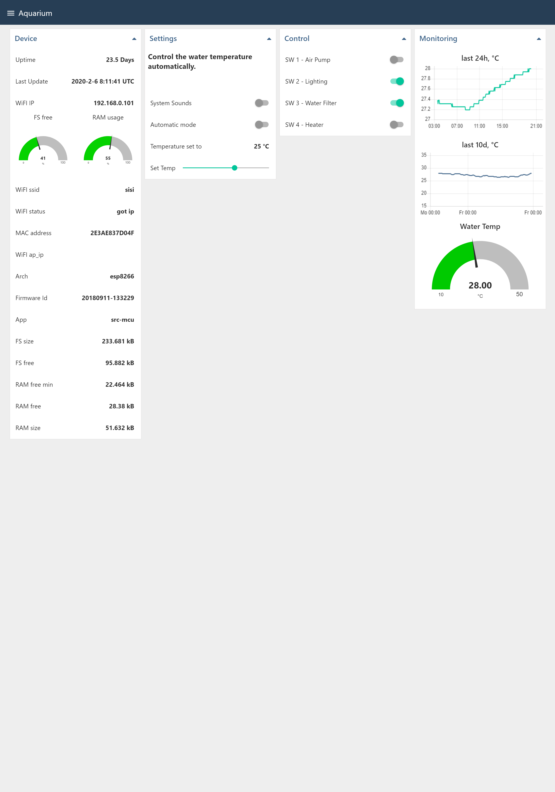
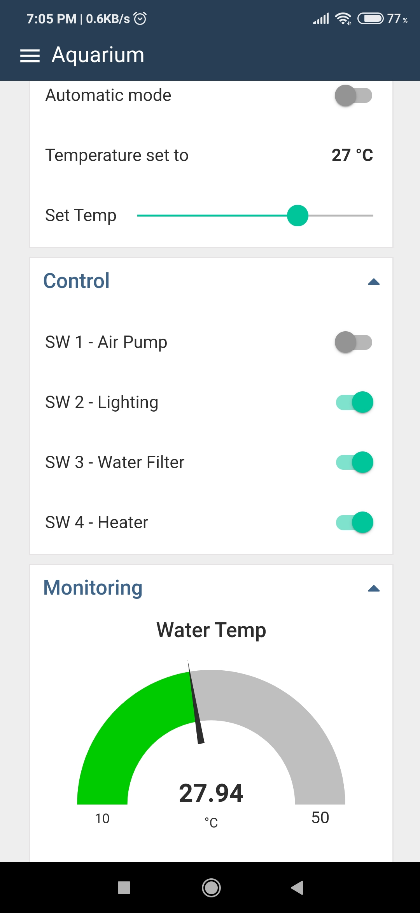
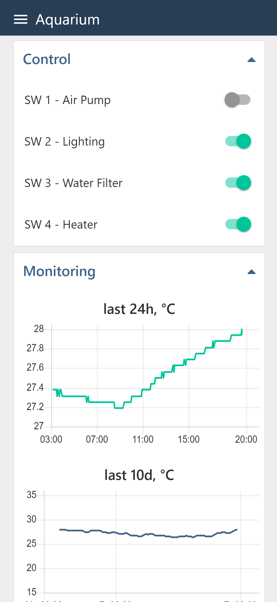

# Aquarium app

## Description

Fish tank controller using esp8266 board, [Mongoose OS](https://mongoose-os.com/) and [Node-RED](https://nodered.org/).

The whole project allows me to take control and monitoring remotely the entire aquarium.

|  |
|:-----------------------------------------:|

- [Aquarium app](#aquarium-app)
  - [Description](#description)
  - [Parts](#parts)
    - [Parts list](#parts-list)
    - [Parts specifications](#parts-specifications)
      - [ESP8266 NodeMCU](#esp8266-nodemcu)
      - [Four Channel relay module](#four-channel-relay-module)
      - [Power supply (5Vdc 10W)](#power-supply-5vdc-10w)
      - [Waterproof DS18B20 temperature sensor](#waterproof-ds18b20-temperature-sensor)
  - [Wiring](#wiring)
  - [Software](#software)

## Parts

### Parts list

The table below describes the required parts, their quantity and the price.

Note that this is approximate price for an item

| n | Description  | Qty | Price €
| --- | --- | --- |--- |
| 1 | [ESP8266 NodeMCU](https://www.aliexpress.com/wholesale?catId=0&initiative_id=SB_20180902020830&SearchText=ESP8266+NodeMCU+V3+Lua) | 1 | 2.00 |
| 2 | [4 Channel relay module](https://www.aliexpress.com/item/TENSTAR-ROBOT-4-channel-relay-module-4-channel-relay-control-board-with-optocoupler-Relay-Output-4/32340914033.html?spm=a2g0s.9042311.0.0.27424c4dG4Srtl) | 1 | 1.80 |
| 3 | [5 Vdc 10W power supply](https://www.aliexpress.com/w/wholesale-5vdc-10w-power-supply.html?spm=2114.search0104.0.0.64f36277dlR7K4&site=glo&groupsort=1&SearchText=5vdc+10w+power+supply&SortType=price_asc&g=y&initiative_id=SC_20180902042248&needQuery=n) | 1 | 3.00 |
| 4 | [Waterproof DS18B20 temperature sensor](https://www.aliexpress.com/item/Direct-waterproof-DS18B20-digital-temperature-sensor-probe-a-large-number-of-original-spot/32675444739.html?spm=a2g0s.9042311.0.0.27424c4deelQyn) | 1 | 1 |
| 5 | Others (wires, connectors, resistors (4.7kOhm), case (~7€), etc..) |  | 10.00 |

### Parts specifications

#### ESP8266 NodeMCU

|  |
|:---------------------------------------------------------------------:|

The ESP8266 NodeMCU is **Single-board microcontroller**, an open source IoT platform. It includes firmware which runs on the ESP8266 Wi-Fi SoC from Espressif Systems, and hardware which is based on the ESP-12 module. The term "NodeMCU" by default refers to the firmware rather than the development kits.

NodeMCU was created shortly after the ESP8266 came out. On December 30, 2013, Espressif Systems began production of the [ESP8266](https://en.wikipedia.org/wiki/NodeMCU).

The Development Kit based on ESP8266, integrates GPIO, PWM, IIC, 1-Wire and ADC all in one board.

Features

- Open-source
- Interactive
- Programmable
- Low cost
- Simple
- Smart
- WI-FI enabled

Technical specifications

- Operating system: XTOS
- CPU: ESP8266 (LX106)
- Memory: 128 kBytes
- Storage: 4 MBytes
- Power consumption: less then watt
- GPIO (General Purpose Input/Output Interface):
  - There are up to 17 GPIO pins
  - The maximum current that can be drawn from a single GPIO pin is 12mA.
  - The ESP8266 is a 3.3V microcontroller, so its I/O operates at 3.3V as well.

#### Four Channel relay module

The Four Channel relay module is used to isolate the control circuit from operation circuit (220Vac)
This is a 5V 4-channel relay interface board, and each channel needs a 15-20mA driver current. It can be used to control various appliances and equipment with large current. It is equiped with high-current relays that work under AC250V 10A or DC30V 10A. It has a standard interface that can be controlled directly by microcontroller.

|  |
|:---------------------------------------------------------------------:|

Features

- Size: 75mm (Length) x 55mm (Width) x 19.3mm (Height)
- Weight: 61g
- PCB Color: Blue
- There are four fixed screw holes at each corner of the board, easy for install and fix. The diameter of the hole is 3.1mm
- High quality relay is used with single pole double throw, a common terminal, a normally open terminal, and a normally closed terminal
- Optical coupling isolation, good anti-interference
- Closed at low level with indicator on, released at high level with indicator off
- VCC is system power source, and JD_VCC is relay power source
- The maximum output of the relay: DC 30V/10A, AC 250V/10A

Technical specifications

- Power supply: 5Vdc
- Pin description
  - Input:
    - VCC: Positive supply voltage
    - GND: Ground
    - IN1..IN4: Relay control port
  - Output:
    - Connect a load, DC 30V/10A，AC 250V/10A

#### Power supply (5Vdc 10W)

The power supply is used to provides the required, continuous, stable voltage and current for the micro-controller and the relay module

Technical specifications

- Input
  - Voltage: 110-220Vac
  - Frequency: 50/60Hz
- Output
  - Voltage: 5Vdc
  - Power: 10W

#### Waterproof DS18B20 temperature sensor

The DS18B20 temperature sensor is used for monitoring the tempreture. Provides 9-bit to 12-bit Celsius temperature measurements

Features

- Unique 1-Wire Interface Requires Only One Port Pin for Communication
- Temperature range: -55 ~ +125
- High quality stainless steel tube (6*50mm)
- Waterproof
- Moisture-proof rust
- The output leads: red (VCC), yellow (DATA), black (GND)

## Wiring

Block diagram and Electrical schematic.
The figures below shows the electrical wiring circuit of the hardware components

<!--

-->

|  |  |
|:---------------------------------------------------------------------:|:---------------------------------------------------------------------:|

## Software

The backend part or application functionalities logic is written on top of [Mongoose OS](https://mongoose-os.com/).

Mongoose OS is an Internet of Things (IoT) Firmware Development Framework available under Apache License Version 2.0. It supports low power, connected microcontrollers such as: ESP32, ESP8266, TI CC3200, STM32. Its purpose is to be a complete environment for prototyping, development and managing connected devices. It is designed to reduce the time and costs associated with IoT projects and has been the subject of numerous positive reviews.

For the frontend part or the user interface style is based on Google's [Material Design](https://material.io/). The user interface is also responsive witch make it looks nice for the variety of devices e.g. laptop, phone or tablet.

|  |  |  |  |
|:---:|:---:|:---:|:---:|
|  |  |  |  |
